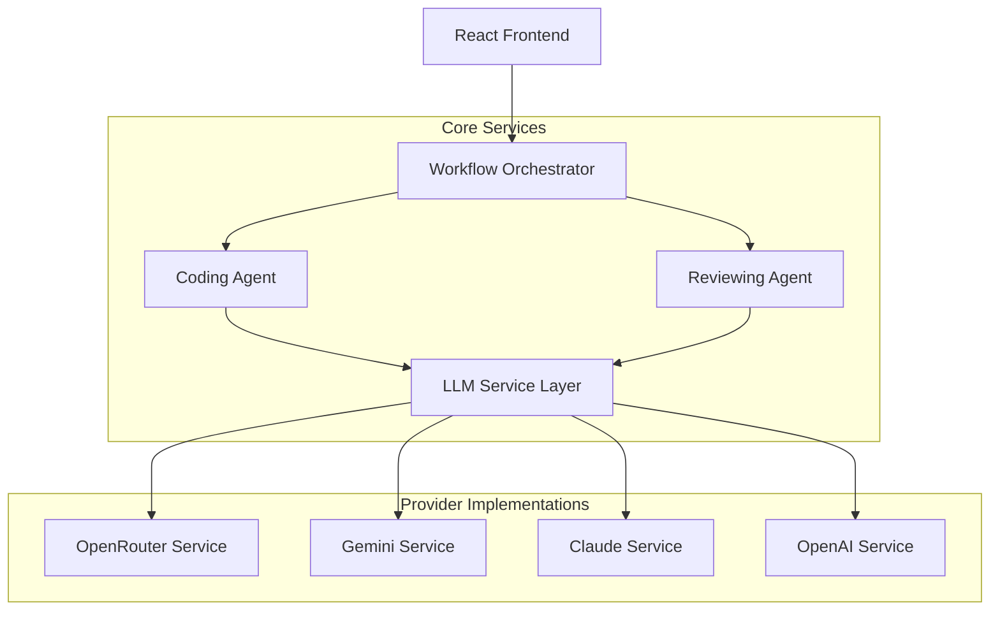

# Design Document

## Overview

The two-agent LLM coding workflow system is designed as a modular, extensible architecture that separates code generation from code review responsibilities. The system leverages the existing React/TypeScript frontend infrastructure while introducing a new backend service layer for LLM orchestration. The architecture follows SOLID principles and implements a unified interface pattern to support multiple LLM providers seamlessly.

## Architecture

### High-Level Architecture



### Service Layer Architecture

The system extends the existing service architecture pattern found in `src/services/` by introducing:

1. **Workflow Orchestrator**: Manages the two-agent workflow
2. **Agent Services**: Separate services for coding and reviewing agents
3. **LLM Service Layer**: Unified interface for multiple providers
4. **Prompt Management**: Centralized prompt templates and engineering

## Components and Interfaces

### Core Interfaces

```typescript
// Base LLM Service Interface
interface LLMService {
  generateCompletion(prompt: string, config?: LLMConfig): Promise<LLMResponse>;
  validateResponse(response: string): boolean;
  getProviderInfo(): ProviderInfo;
}

// Workflow Orchestrator Interface
interface WorkflowOrchestrator {
  executeWorkflow(request: CodingRequest): Promise<WorkflowResult>;
  getCodingAgent(): CodingAgent;
  getReviewingAgent(): ReviewingAgent;
}

// Agent Interfaces
interface CodingAgent {
  generateCode(request: CodingRequest): Promise<CodeResult>;
}

interface ReviewingAgent {
  reviewCode(code: CodeResult, originalRequest: CodingRequest): Promise<ReviewResult>;
}
```

### Provider Implementations

Building on the existing Gemini integration pattern, each provider implements the `LLMService` interface:

```typescript
class OpenRouterService implements LLMService {
  private apiKey: string;
  private baseUrl: string = 'https://openrouter.ai/api/v1/chat/completions';
  
  async generateCompletion(prompt: string, config?: LLMConfig): Promise<LLMResponse> {
    // Implementation with retry logic and error handling
  }
}

class GeminiService implements LLMService {
  // Extends existing geminiApi.ts functionality
}
```

### Prompt Management System

```typescript
interface PromptTemplate {
  id: string;
  role: 'coding' | 'reviewing';
  template: string;
  variables: string[];
  metadata: PromptMetadata;
}

class PromptManager {
  getPrompt(id: string, variables: Record<string, any>): string;
  registerPrompt(template: PromptTemplate): void;
  validatePrompt(template: PromptTemplate): boolean;
}
```

## Data Models

### Request/Response Models

```typescript
interface CodingRequest {
  task: string;
  requirements: string[];
  language: string;
  framework?: string;
  style: CodeStyle;
  constraints: string[];
}

interface CodeResult {
  code: string;
  language: string;
  explanation: string;
  files?: Array<{
    path: string;
    content: string;
  }>;
  metadata: CodeMetadata;
}

interface ReviewResult {
  originalCode: CodeResult;
  reviewNotes: ReviewNote[];
  improvedCode?: CodeResult;
  suggestions: Suggestion[];
  score: QualityScore;
}

interface WorkflowResult {
  originalCode: CodeResult;
  review: ReviewResult;
  finalCode: CodeResult;
  executionTime: number;
  providerUsed: string;
}
```

### Configuration Models

```typescript
interface LLMConfig {
  model: string;
  temperature: number;
  maxTokens: number;
  retryAttempts: number;
  timeout: number;
}

interface ProviderConfig {
  name: string;
  apiKey: string;
  baseUrl: string;
  defaultModel: string;
  rateLimits: RateLimit;
}
```

## Error Handling

### Retry Strategy

The system implements a robust retry mechanism with exponential backoff:

```typescript
class RetryHandler {
  async executeWithRetry<T>(
    operation: () => Promise<T>,
    config: RetryConfig
  ): Promise<T> {
    // Exponential backoff implementation
    // Rate limit handling
    // Circuit breaker pattern
  }
}
```

### Error Types

```typescript
enum ErrorType {
  NETWORK_ERROR = 'NETWORK_ERROR',
  API_RATE_LIMIT = 'API_RATE_LIMIT',
  INVALID_RESPONSE = 'INVALID_RESPONSE',
  PROVIDER_UNAVAILABLE = 'PROVIDER_UNAVAILABLE',
  VALIDATION_ERROR = 'VALIDATION_ERROR'
}

class WorkflowError extends Error {
  constructor(
    public type: ErrorType,
    message: string,
    public provider?: string,
    public retryable: boolean = true
  ) {
    super(message);
  }
}
```

### Fallback Strategy

1. **Provider Fallback**: If primary provider fails, automatically switch to backup
2. **Graceful Degradation**: Return partial results if review agent fails
3. **Cache Integration**: Store successful results to reduce API calls

## Testing Strategy

### Unit Testing

- **Service Layer Tests**: Mock LLM providers for isolated testing
- **Prompt Template Tests**: Validate prompt generation and variable substitution
- **Error Handling Tests**: Simulate various failure scenarios
- **Retry Logic Tests**: Verify exponential backoff and circuit breaker behavior

### Integration Testing

- **End-to-End Workflow Tests**: Test complete coding workflow with real providers
- **Provider Integration Tests**: Validate each LLM service implementation
- **Error Recovery Tests**: Test fallback mechanisms and error handling

### Test Structure

```typescript
// Example test structure extending existing vitest setup
describe('WorkflowOrchestrator', () => {
  describe('executeWorkflow', () => {
    it('should complete coding workflow successfully', async () => {
      // Test implementation
    });
    
    it('should handle provider failures gracefully', async () => {
      // Test fallback mechanisms
    });
  });
});
```

## Integration with Existing Codebase

### Frontend Integration

The system integrates with the existing React frontend by:

1. **Extending UI Components**: Add new form components for coding requests
2. **Service Integration**: Utilize existing service patterns from `src/services/`
3. **Type System**: Extend existing types in `src/types/index.ts`
4. **State Management**: Use existing patterns for managing workflow state

### Backend Service Layer

The new services follow the established patterns:

1. **Service Structure**: Mirror existing `geminiApi.ts` structure
2. **Error Handling**: Extend existing error handling patterns
3. **Configuration**: Use environment variables following existing `.env.example` pattern
4. **Testing**: Integrate with existing Vitest setup

### Configuration Management

```typescript
// Environment variables (extending .env.example)
VITE_OPENROUTER_API_KEY=sk-or-v1-...
VITE_GEMINI_API_KEY=AIzaSy...
VITE_CLAUDE_API_KEY=sk-ant-...
VITE_OPENAI_API_KEY=sk-...

// Default provider priority
VITE_PRIMARY_LLM_PROVIDER=openrouter
VITE_FALLBACK_LLM_PROVIDER=gemini
```

## Performance Considerations

### Optimization Strategies

1. **Request Batching**: Combine multiple small requests when possible
2. **Response Caching**: Cache successful code generations and reviews
3. **Streaming Responses**: Support streaming for long code generations
4. **Lazy Loading**: Load provider services only when needed

### Monitoring and Metrics

```typescript
interface WorkflowMetrics {
  executionTime: number;
  providerUsed: string;
  tokensUsed: number;
  cacheHitRate: number;
  errorRate: number;
}

class MetricsCollector {
  recordWorkflowExecution(metrics: WorkflowMetrics): void;
  getProviderPerformance(): ProviderMetrics[];
  getErrorAnalytics(): ErrorAnalytics;
}
```

## Security Considerations

### API Key Management

1. **Environment Variables**: Store API keys securely in environment variables
2. **Key Rotation**: Support for rotating API keys without service interruption
3. **Access Control**: Implement rate limiting and usage quotas

### Input Validation

```typescript
class InputValidator {
  validateCodingRequest(request: CodingRequest): ValidationResult;
  sanitizePrompt(prompt: string): string;
  validateCodeOutput(code: string): SecurityScanResult;
}
```

### Content Filtering

1. **Prompt Injection Prevention**: Sanitize user inputs to prevent prompt injection
2. **Code Safety**: Validate generated code for potential security issues
3. **Output Filtering**: Remove sensitive information from responses