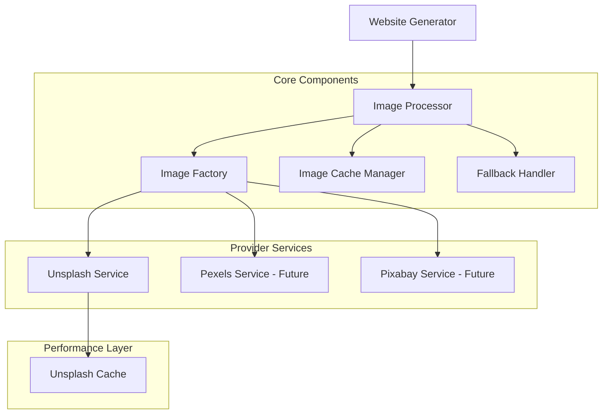

# Design Document

## Overview

The Unsplash image integration system enhances the AI website builder by automatically replacing placeholder images with contextually relevant, high-quality images from Unsplash. The architecture follows the Strategy pattern for extensible image provider support, implements performance optimizations through caching and lazy loading, and integrates seamlessly with the existing website generation workflow in `src/services/geminiApi.ts`.

## Architecture

### High-Level Architecture



### Integration with Existing System

The image integration extends the current website generation flow:

1. **Website Generation**: Existing `generateWebsite()` function creates HTML/CSS/JS
2. **Image Processing**: New `processImages()` function analyzes and replaces placeholders
3. **Enhanced Output**: Returns website with real images integrated

## Components and Interfaces

### Core Interfaces

```typescript
// Base Image Provider Interface
interface ImageProvider {
  searchImages(query: string, options?: SearchOptions): Promise<ImageResult[]>;
  getImageUrl(imageId: string, size?: ImageSize): Promise<string>;
  getProviderInfo(): ProviderInfo;
}

// Image Processing Interface
interface ImageProcessor {
  processWebsite(website: GeneratedWebsite, request: WebsiteRequest): Promise<GeneratedWebsite>;
  extractImageQueries(html: string, request: WebsiteRequest): string[];
  replaceImagePlaceholders(html: string, imageMap: Map<string, string>): string;
}

// Cache Interface
interface ImageCache {
  get(key: string): Promise<string | null>;
  set(key: string, value: string, ttl?: number): Promise<void>;
  clear(): Promise<void>;
}
```

### Provider Implementations

```typescript
class UnsplashService implements ImageProvider {
  private apiKey: string;
  private baseUrl: string = 'https://api.unsplash.com';
  private cache: ImageCache;
  
  async searchImages(query: string, options?: SearchOptions): Promise<ImageResult[]> {
    // Implementation with rate limiting and error handling
  }
  
  async getImageUrl(imageId: string, size?: ImageSize): Promise<string> {
    // Return optimized image URL based on size requirements
  }
}

class ImageProviderFactory {
  static createProvider(type: 'unsplash' | 'pexels' | 'pixabay'): ImageProvider {
    // Factory pattern implementation
  }
}
```

### Image Processing Service

```typescript
class ImageProcessorService implements ImageProcessor {
  private provider: ImageProvider;
  private cache: ImageCache;
  private fallbackHandler: FallbackHandler;
  
  async processWebsite(website: GeneratedWebsite, request: WebsiteRequest): Promise<GeneratedWebsite> {
    // Main processing logic
  }
  
  extractImageQueries(html: string, request: WebsiteRequest): string[] {
    // Extract meaningful queries from content and request context
  }
  
  replaceImagePlaceholders(html: string, imageMap: Map<string, string>): string {
    // Replace placeholder img tags with real URLs
  }
}
```

## Data Models

### Request/Response Models

```typescript
interface ImageSearchOptions {
  count?: number;
  orientation?: 'landscape' | 'portrait' | 'squarish';
  category?: string;
  minWidth?: number;
  minHeight?: number;
}

interface ImageResult {
  id: string;
  url: string;
  thumbnailUrl: string;
  width: number;
  height: number;
  altText: string;
  photographer: string;
  photographerUrl?: string;
}

interface ImageSize {
  width: number;
  height: number;
  quality?: 'low' | 'medium' | 'high';
}

interface ProcessedWebsite extends GeneratedWebsite {
  imageMetadata: {
    totalImages: number;
    processedImages: number;
    failedImages: number;
    cacheHits: number;
    processingTime: number;
  };
}
```

### Configuration Models

```typescript
interface UnsplashConfig {
  accessKey: string;
  secretKey: string;
  applicationId: string;
  rateLimit: {
    requestsPerHour: number;
    requestsPerMinute: number;
  };
  defaultImageSize: ImageSize;
  cacheTTL: number;
}

interface ImageProcessingConfig {
  provider: 'unsplash' | 'pexels' | 'pixabay';
  enableCache: boolean;
  enableLazyLoading: boolean;
  fallbackStrategy: 'placeholder' | 'generic' | 'none';
  maxConcurrentRequests: number;
}
```

## Performance Optimizations

### Caching Strategy

```typescript
class ImageCacheManager implements ImageCache {
  private memoryCache: Map<string, CacheEntry>;
  private localStorage: Storage;
  
  async get(key: string): Promise<string | null> {
    // Check memory cache first, then localStorage
  }
  
  async set(key: string, value: string, ttl: number = 3600): Promise<void> {
    // Store in both memory and localStorage with TTL
  }
  
  private cleanExpiredEntries(): void {
    // Remove expired cache entries
  }
}

interface CacheEntry {
  value: string;
  timestamp: number;
  ttl: number;
}
```

### Lazy Loading Implementation

```typescript
class LazyImageLoader {
  static injectLazyLoading(html: string): string {
    // Add intersection observer and lazy loading attributes
  }
  
  static generateLazyLoadingScript(): string {
    // Return JavaScript for progressive image loading
  }
}
```

### Rate Limiting

```typescript
class RateLimiter {
  private requests: number[] = [];
  private maxRequests: number;
  private timeWindow: number;
  
  async canMakeRequest(): Promise<boolean> {
    // Check if request is within rate limits
  }
  
  async waitForAvailability(): Promise<void> {
    // Wait until rate limit allows new request
  }
}
```

## Error Handling and Fallbacks

### Fallback Strategy

```typescript
class FallbackHandler {
  private fallbackImages: Map<string, string>;
  
  constructor() {
    this.fallbackImages = new Map([
      ['hero', 'data:image/svg+xml;base64,PHN2ZyB3aWR0aD0iODAwIiBoZWlnaHQ9IjQwMCI+...'],
      ['feature', 'data:image/svg+xml;base64,PHN2ZyB3aWR0aD0iMzAwIiBoZWlnaHQ9IjIwMCI+...'],
      ['about', 'data:image/svg+xml;base64,PHN2ZyB3aWR0aD0iNDAwIiBoZWlnaHQ9IjMwMCI+...']
    ]);
  }
  
  getFallbackImage(context: string): string {
    // Return appropriate fallback based on context
  }
  
  generatePlaceholderSVG(width: number, height: number, text?: string): string {
    // Generate SVG placeholder with dimensions and optional text
  }
}
```

### Error Types

```typescript
enum ImageError {
  API_RATE_LIMIT = 'API_RATE_LIMIT',
  NETWORK_ERROR = 'NETWORK_ERROR',
  INVALID_RESPONSE = 'INVALID_RESPONSE',
  QUOTA_EXCEEDED = 'QUOTA_EXCEEDED',
  IMAGE_NOT_FOUND = 'IMAGE_NOT_FOUND'
}

class ImageProcessingError extends Error {
  constructor(
    public type: ImageError,
    message: string,
    public query?: string,
    public retryable: boolean = true
  ) {
    super(message);
  }
}
```

## Integration with Existing Codebase

### Enhanced Website Generation

The system extends the existing `generateWebsite` function:

```typescript
// Enhanced version of geminiApi.ts function
export async function generateWebsiteWithImages(request: WebsiteRequest): Promise<ProcessedWebsite> {
  // 1. Generate base website using existing logic
  const baseWebsite = await generateWebsite(request);
  
  // 2. Process images if enabled
  if (shouldProcessImages(request)) {
    const imageProcessor = new ImageProcessorService();
    const processedWebsite = await imageProcessor.processWebsite(baseWebsite, request);
    return processedWebsite;
  }
  
  return baseWebsite as ProcessedWebsite;
}

function shouldProcessImages(request: WebsiteRequest): boolean {
  // Determine if image processing should be enabled
  return process.env.VITE_ENABLE_IMAGE_PROCESSING === 'true' && 
         process.env.VITE_UNSPLASH_ACCESS_KEY !== undefined;
}
```

### Configuration Management

```typescript
// Environment variables (extending .env.example)
VITE_UNSPLASH_ACCESS_KEY=WqmxOkaoBr3HuHW6SUrxFbCRJI7kVk4iZfqf4t9NMHw
VITE_UNSPLASH_SECRET_KEY=QQ16M1m249O5sWiv9uTMVK8T1E1slpuxXLURt_do_Qo
VITE_UNSPLASH_APPLICATION_ID=797214
VITE_ENABLE_IMAGE_PROCESSING=true
VITE_IMAGE_CACHE_TTL=3600
VITE_MAX_CONCURRENT_IMAGE_REQUESTS=5
```

## Query Extraction Strategy

### Content Analysis

```typescript
class QueryExtractor {
  extractFromWebsiteRequest(request: WebsiteRequest): string[] {
    const queries: string[] = [];
    
    // Primary queries from request
    queries.push(request.title);
    queries.push(request.description);
    queries.push(...request.features);
    
    // Context-based queries
    queries.push(`${request.type} website`);
    queries.push(`${request.style} design`);
    
    return this.cleanAndPrioritizeQueries(queries);
  }
  
  extractFromHTML(html: string): string[] {
    // Extract from headings, alt texts, and semantic content
    const queries: string[] = [];
    
    // Extract from headings
    const headings = html.match(/<h[1-6][^>]*>(.*?)<\/h[1-6]>/gi) || [];
    headings.forEach(heading => {
      const text = heading.replace(/<[^>]*>/g, '').trim();
      if (text.length > 3) queries.push(text);
    });
    
    // Extract from section contexts
    const sections = ['hero', 'about', 'features', 'services', 'contact'];
    sections.forEach(section => {
      if (html.includes(`class="${section}`) || html.includes(`id="${section}`)) {
        queries.push(section);
      }
    });
    
    return queries;
  }
  
  private cleanAndPrioritizeQueries(queries: string[]): string[] {
    // Remove duplicates, clean text, and prioritize by relevance
    return [...new Set(queries)]
      .map(q => q.toLowerCase().trim())
      .filter(q => q.length > 2)
      .slice(0, 10); // Limit to top 10 queries
  }
}
```

## Security Considerations

### API Key Management

```typescript
class SecureConfigManager {
  private static validateApiKey(key: string): boolean {
    // Validate API key format and basic security checks
    return key.length > 20 && key.startsWith('WqmxOkaoBr3HuHW6SUrxFbCRJI7kVk4iZfqf4t9NMHw');
  }
  
  static getUnsplashConfig(): UnsplashConfig {
    const accessKey = process.env.VITE_UNSPLASH_ACCESS_KEY;
    if (!accessKey || !this.validateApiKey(accessKey)) {
      throw new Error('Invalid or missing Unsplash API key');
    }
    
    return {
      accessKey,
      secretKey: process.env.VITE_UNSPLASH_SECRET_KEY!,
      applicationId: process.env.VITE_UNSPLASH_APPLICATION_ID!,
      rateLimit: {
        requestsPerHour: 50,
        requestsPerMinute: 50
      },
      defaultImageSize: { width: 800, height: 600 },
      cacheTTL: 3600
    };
  }
}
```

### Content Filtering

```typescript
class ContentFilter {
  private blockedTerms: Set<string> = new Set([
    // Add inappropriate terms to filter
  ]);
  
  sanitizeQuery(query: string): string {
    // Remove potentially inappropriate content from search queries
    const cleaned = query.toLowerCase().trim();
    
    for (const term of this.blockedTerms) {
      if (cleaned.includes(term)) {
        return 'business professional'; // Safe fallback
      }
    }
    
    return query;
  }
}
```